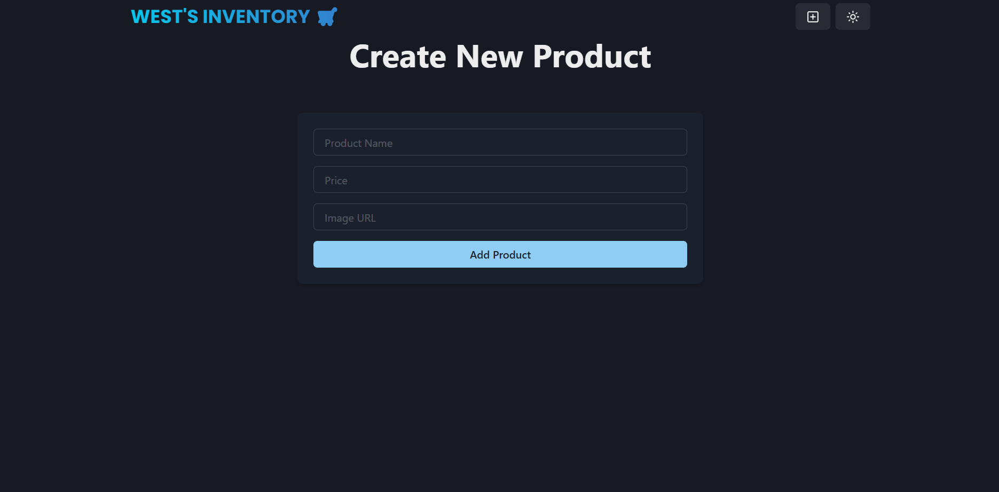
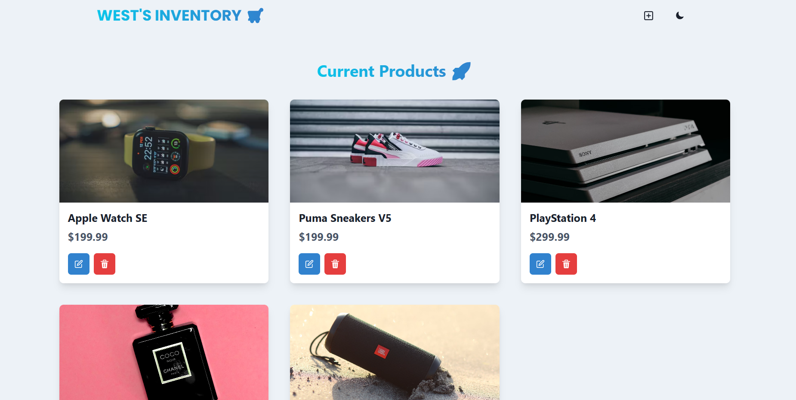

# 🛒 Inventory Management System (MERN Stack)

A full-stack **Inventory Management System** built using the **MERN stack** (MongoDB, Express.js, React, Node.js). This application allows users to manage products with CRUD operations and features a clean UI with Chakra UI.

---

## 🚀 Features

- 🔍 View all products
- ➕ Add new products
- ✏️ Edit product details
- 🗑️ Delete products
- 🌗 Dark mode toggle
- 📱 Fully responsive design with Chakra UI

---

## 📸 Screenshots

### 🏠 Home Page

### ➕ Add Product Modal

### 🌙 Light/Dark Mode Enabled

---

## ⚙️ Technologies Used

### 💻 Frontend:
- React
- Chakra UI
- React Router

### 🌐 Backend:
- Node.js
- Express
- MongoDB + Mongoose
- dotenv
- cross-env

---

## 🔧 Setup Instructions

### 1. Clone the Repository

### 2. Backend Setup
  cd backend
  npm install
  
### 3. Create a .env file:
MONGO_URI=your_mongodb_connection_string 

PORT=5000

NODE_ENV=development 

### 4. Start the backend server:
  npm run dev

### 5. Frontend Setup
  cd frontend
  
  npm install
  
  npm run dev
